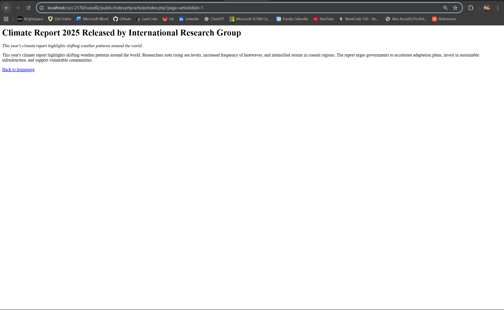
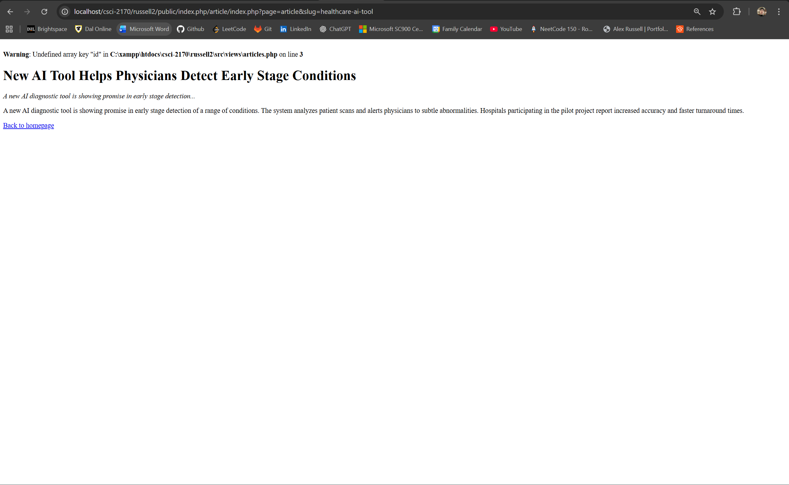
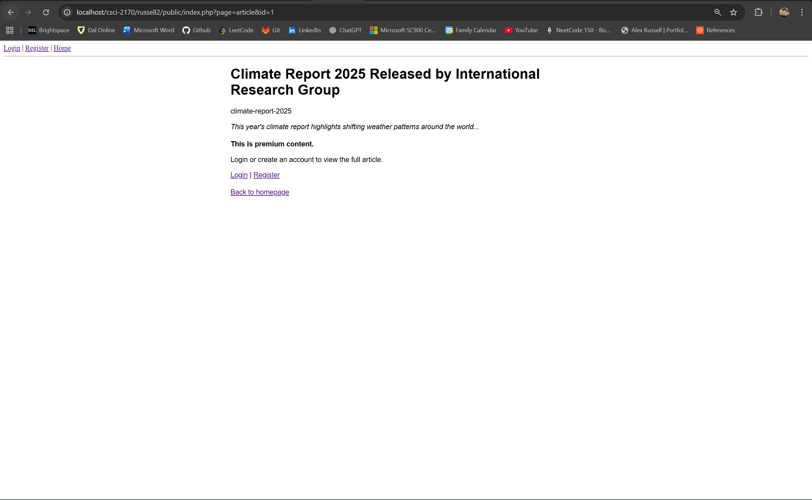
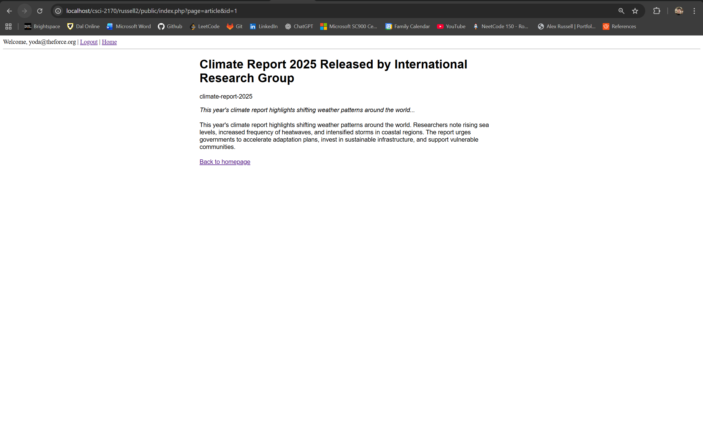

## Application name and description

- Created class `ArticleController` using PHP OOP princples with getter methods: `getAllArticles()` and `getArticleById()` to display/route to desired results. (Really proud of this solution actually)
- Continuing with an OOP approach (since thats where im most comfortable) with user auth. 
- Login system, allowing those who do have an account to see premium content, prompting to register/login if not. 
- Logging out destroys current session.

## Setup and test instructions

- git clone the repo into root directory (typically xampp/htdocs)

- run appache and mysql in xampp control panel

- open browser and enter localhost/{path/to/index.php} !

- now you should see a list of articles

## Tests

*Disclaimer*: all tests were done during development of that feature. So UI will be different throughout. 

### Test 1: ID routing (Default) 

### Test 2: Slug Routing (Optional)

at the time of this screenshot a visual bug when searching with slug was occuring with occuring with the id variable.

### Test 3: Premium Article without being logged in

As you can see we are logged in as Yoda and now have access to the articles content

### Test 4: Premium Article while being registered
